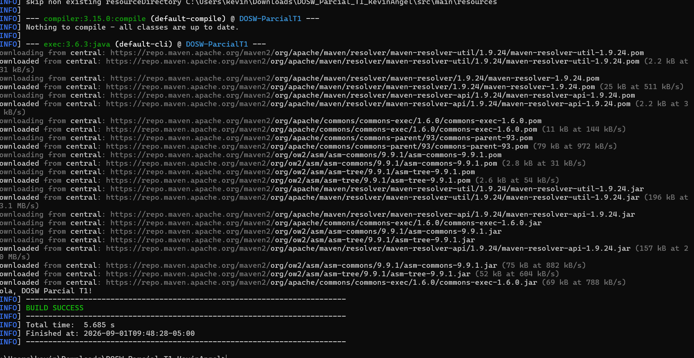

# DOSW - Parcial Práctico T1

**Nombre completo:** Santiago Andres Garcia Almario

**Grupo DOSW:** 1

**Bitacora:** https://github.com/SantiagoAGarcia/Bitacora-1.git

**Enunciado asignado:** _(completar en la Parte 3)_

## Estructura del proyecto

```
DOSW-ParcialT1
|-- pom.xml
|-- src
|   |-- main
|   |   |-- java
|   |       |-- edu/dosw/parcial/App.java
|   |-- test
|       |-- java
|           |-- edu/dosw/parcial/AppTest.java
|-- docs/
|   |-- uml/            # Diagramas UML exportados en PDF o PNG
|   |-- images/         # Capturas de ejecución
|   |-- requirements/   # Requisitos funcionales y no funcionales
|-- .gitignore
|-- README.md
```

## Evidencias de prerrequisitos

### Herramienta de modelado — Draw.io

Acceso activo a cuenta de draw.io, con documentos recientes visibles.


### Herramienta de diseño de interfaces — Figma

Acceso activo a cuenta de Figma, con archivos recientes visibles.


### Proyecto corriendo con Maven

Ejecución de `mvn compile exec:java -Dexec.mainClass="edu.dosw.parcial.App"` finalizando en `BUILD SUCCESS`.


